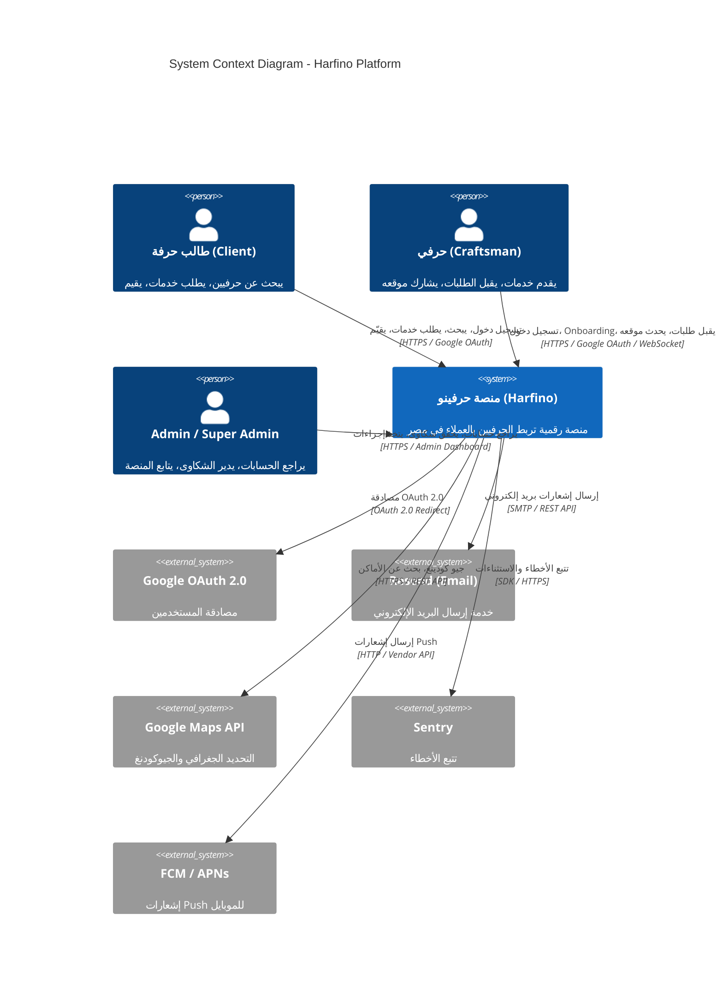

# C4 Model - Level 1: System Context

---

## وصف النظام

حرفينو هو **منصة رقمية مخصصة للحرفيين المصريين** تربط بين العميل الذي يريد خدمة حرفية والحرفي الذي يقدمها.

### المستخدمون (People)
| النوع | الوصف |
|-------|-------|
| **طالب حرفة** | يبحث عن حرفي، يطلب الخدمة، يُقيّم بعد الانتهاء |
| **حرفي** | يسجّل دخول، يكمل Onboarding، يقبل الطلبات، يشارك موقعه |
| **Admin** | يراجع حسابات الحرفيين، يحقق الشكاوى، يتخذ إجراءات (تجميد/حظر/رفض) |

### الأنظمة الخارجية (External Systems)
| النظام | الغرض |
|--------|-------|
| **Google OAuth 2.0** | المصادقة الموحدة للمستخدمين (بدون كلمة مرور) |
| **Resend** | إرسال البريد الإلكتروني (ترحيب، قبول/رفض، إشعارات) |
| **Google Maps API** | تحويل العنوان إلى إحداثيات + بحث عن الأماكن |
| **Sentry** | تتبع الأخطاء في الإنتاج |
| **FCM / APNs** | إشعارات Push للموبايل (لاحقاً) |

### تعليمات مبدئية
- استخدم **الخطوط العريضة** للوحدات الداخلية
- استخدم **الألوان** لتمييز أنواع المستخدمين والأنظمة الخارجية
- كل علاقة موصوفة بـ **تسمية + بروتوكول**

---

## علاقات النظام (System Relationships)

1. **العميل ↔ حرفينو**: العميل يبحث ويطلب الخدمات عبر HTTPS
2. **الحرفي ↔ حرفينو**: الحرفي يسجّل دخول، يكمل onboarding، يقبل/يرفض طلبات، يشارك موقعه المباشر
3. **الAdmin ↔ حرفينو**: Admin يراجع الحسابات الجديدة، يحقق الشكاوى، يتخذ قرارات تجميد/حظر
4. **حرفينو ↔ Google OAuth**: تدفق OAuth 2.0 للمصادقة الموحدة
5. **حرفينو ↔ Resend**: إرسال بريد إلكتروني لنتائج المراجعة والإشعارات
6. **حرفينو ↔ Google Maps API**: جيو كودينغ العنوان وتحويله إلى إحداثيات
7. **حرفينو ↔ Sentry**: تتبع الأخطاء في الإنتاج
8. **حرفينو ↔ FCM/APNs**: إشعارات Push للموبايل

---

## القيود (Constraints)
- **اللغة**: واجهة عربية RTL (من اليمين لليسار)
- **المصادقة**: Google OAuth فقط (لا تسجيل بكلمة مرور)
- **منطقة**: مصر فقط (للا)
- **الأدوار**: 4 أدوار (client, craftsman, admin, super_admin)

---

## الخطة (Landscape)
- **حرفينو** هي المنصة الرئيسية (Modular Monolith on Next.js + PostgreSQL)
- **Next.js** يقدم SSR/SSG للواجهة + API Routes للـ Backend
- **PostgreSQL** هو SSOT (المصدر الوحيد للحقيقة)
- **Valkey** للتخزين المؤقت (Cache + Distributed Queue)
- **WebSocket** لتحديث الموقع المباشر للحرفيين المتاحين
