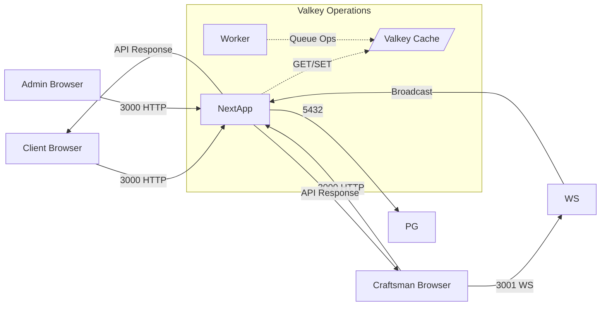

# C4 Model - Level 2: Container (Deployment Architecture)

```mermaid
C4Container
    title Container Diagram - Harfino Platform Deployment

    Person(admin, "Admin", "يراجع حسابات، يدير الشكاوى")

    System_Ext(google, "Google OAuth", "OAuth 2.0 Provider")
    System_Ext(resend, "Resend Email", "Email Provider")
    System_Ext(maps, "Google Maps", "Geocoding & Places API")

    System_Boundary(harfino_platform, "منصة حرفينو (Harfino) — Docker Compose") {
        Container(web, "Next.js App", "Next.js 16 + TypeScript + Tailwind", "Fullstack app: SSR/SSG + API Routes + WebSocket server\nport: 3000 (HTTP) + 3001 (WS)")
        ContainerDb(postgres, "PostgreSQL", "PostgreSQL 16 + Drizzle ORM", "SSOT: Users, Craftsmen, Orders, Reviews, Complaints, Notifications\nport: 5432")
        Container(valkey, "Valkey", "Valkey (Open-source Redis fork)", "Cache: Hot data, sessions, rate limiting, distributed queue\nport: 6379")
        Container(worker, "Background Workers", "Node.js + BullMQ", "Email jobs, cleanup, realtime sync, webhooks retry")
    }

    System_Ext(sentry, "Sentry", "Error Tracking")

    Rel(admin, web, "إدارة لوحة التحكم", "HTTPS / Browser")
    Rel(web, postgres, "ORM (Drizzle) queries + migrations", "TCP 5432")
    Rel(web, valkey, "Session cache, Hot reads, distributed locks", "TCP 6379")
    Rel(worker, postgres, "Background writes", "TCP 5432")
    Rel(worker, valkey, "Distributed Queue (BullMQ)", "TCP 6379")
    Rel(worker, resend, "إرسال بريد إلكتروني", "HTTPS")
    Rel(web, google, "OAuth redirects", "HTTPS Redirect")
    Rel(web, maps, "Geocoding addresses", "HTTPS")
    Rel(web, sentry, "Error events", "HTTPS")
    Rel(worker, web, "Webhook callbacks (incoming)", "HTTP")
    Rel(client, web, "تصفح + طلب خدمات + تحديث موقع", "HTTPS + WebSocket 3001")
```

---

## Container Description

### 1. Next.js App (Port 3000 + 3001)
```
التقنية: Next.js 16 + TypeScript + Tailwind CSS
المسؤولية:
  - SSR/SSG/ISR للصفحات
  - API Routes (Route Handlers) للـ REST/CRUD
  - WebSocket Server للتحديث المباشر (Real-time Location)
  - NextAuth middleware
  - React Query SWR على العميل
الميزات:
  - App Router (Next.js 16+)
  - Server Components + Client Components
  - PWA (next-pwa) للعملاء الموبايل
```

### 2. PostgreSQL (Port 5432)
```
التقنية: PostgreSQL 16 + Drizzle ORM
المسؤولية:
  - SSOT: المصدر الوحيد للحقيقة
  - تخزين كافة البيانات: Users, Craftsmen, Orders, Reviews, Complaints, Notifications
  - Audit logs
  - Webhook configurations
الميزات:
  - شهادات UUID كـ PK
  - Indexes محسّنة للبحث الجغرافي (GIST + BTREE)
  - Full-text search (للمراجعات والملاحظات)
  - Row Level Security (RLS) في المستقبل
```

### 3. Valkey (Port 6379)
```
التقنية: Valkey (Open-source Redis fork)
المسؤولية:
  - Cache Aside: Hot reads (Craftsman profiles, lists)
  - Session storage (JWT blacklist + rate limiting)
  - Distributed Queue (BullMQ backing store)
  - Distributed Locks (SETNX) لمنع Race Conditions
  - Rate Limiting (Sliding Window counters)
الميزات:
  - TTL management
  - Pub/Sub للـ WebSocket (بديل متقدم)
  - Atomic operations للـ Locks
```

### 4. Background Workers (Node.js + BullMQ)
```
التقنية: Node.js + TypeScript + BullMQ + Valkey
المسؤولية:
  - إرسال بريد إلكتروني (Resend API)
  - Cleanup sessions منتهية الصلاحية
  - Webhook retries مع exponential backoff
  - Realtime location sync (اختياري)
  - Report generation للـ Admin
الميزات:
  - BullMQ Queues مع优先级
  - Dead Letter Queue للرسائل الفاشلة
  - Retry mechanism: 3 محاولات + exponential backoff
```

---

## Infrastructure Diagram (Docker Compose)

```mermaid
flowchart TD
    subgraph "Docker Compose - Development"
        subgraph "Infrastructure"
            PG[("PostgreSQL 16<br/>port: 5432<br/>Drizzle ORM")]
            Valkey[("Valkey Cache<br/>port: 6379<br/>Cache + Queue")]
        end

        subgraph "Application Layer"
            NextApp[("Next.js App<br/>Port: 3000<br/>HTTP + SSR/SSG<br/>API Routes + RSC")]
            WS[("WebSocket Server<br/>Port: 3001<br/>Realtime Location")]
            Worker[("Background Workers<br/>BullMQ + Valkey")]
        end
    end

    subgraph "External Services"
        Google["Google OAuth"]
        Resend["Resend Email"]
        Maps["Google Maps API"]
        Sentry["Sentry"]
    end

    style NextApp fill:#10b981,color:white
    style Valkey fill:#f59e0b,color:white
    style PG fill:#3b82f6,color:white
    style Worker fill:#8b5cf6,color:white
    style WS fill:#ef4444,color:white

    NextApp --> PG : "Drizzle ORM\n(Read/Write)"
    NextApp --> Valkey : "Session + Cache\nRate Limiting"
    NextApp --> WS : "WebSocket\nUpgrade"
    Worker --> Valkey : "BullMQ Queue"
    Worker --> PG : "Background Jobs"
    NextApp --> Google : "OAuth Redirect"
    NextApp --> Resend : "Email Notifications"
    NextApp --> Maps : "Geocoding"
    NextApp --> Sentry : "Error Tracking"
```

---

## Traffic & Data Flow



---

## Key Architecture Decisions

| Decision | Rationale |
|----------|-----------|
| **Next.js Fullstack** | Unified codebase for SSR, API, and WebSocket — easier deployment than separated services |
| **PostgreSQL as SSOT** | Avoids cache invalidation bugs; Valkey is purely ephemeral |
| **Valkey over Redis** | Open-source fork, no vendor lock-in, identical API compatibility |
| **Drizzle ORM** | Type-safe, minimal bundle, better than Prisma for large schemas |
| **BullMQ + Valkey** | Native integration with Valkey buffer; no separate Redis needed |
| **Port 3001 for WS** | Separation of concerns; avoids Next.js dev-server coupling |
| **WebSocket in Next.js** | Uses ws library directly in Route Handler (Next.js 16+) |

---

## Monitoring Points (Container View)

| Metric | Where to Observe | Tool |
|--------|------------------|------|
| HTTP Response Time | Next.js + Vercel Edge | Sentry, Vercel Analytics |
| WebSocket Connections | WS Server | Custom metric → Prometheus |
| Postgres Query Time | PG + Drizzle | pg_stat_statements, DataDog |
| Valkey Hit Rate | Valkey INFO command | Valkey command: `INFO stats` |
| Job Queue Length | BullMQ Dashboard / Valkey | BullMQ metrics |
| CPU/Memory per container | Docker stats | Docker + Prometheus |
| Error Rate | Sentry | Sentry Dashboard |

---

## Performance Targets

| Container | Metric | Target |
|-----------|--------|--------|
| Next.js | P95 Response Time | < 500ms |
| PostgreSQL | P95 Query Time | < 100ms |
| Valkey | Hit Rate | > 80% |
| WebSocket | Connection latency | < 200ms |
| BullMQ Worker | Processing SLA | < 30s for email |

---

## Related Documents
- [Plan](plan.md) — Full project plan
- [ADR-001: Using Valkey over Redis](adr/) — Architecture Decision Record
- [C4 Level 3 Component](c4-l3-component-internal.md) — Module Internal Structure
- [Docker Compose](docker-compose.yml) — Infrastructure as Code
