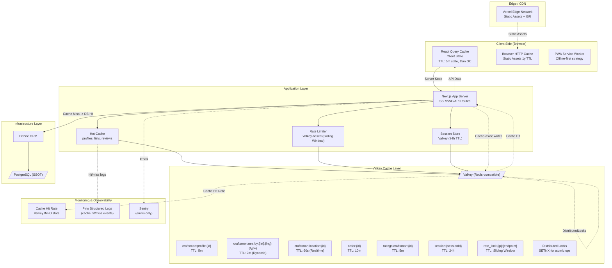
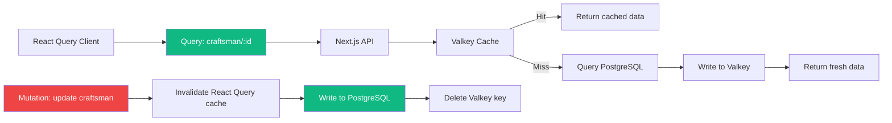

# Caching Strategy - Valkey + React Query + HTTP Cache



---

## Cache Layer Strategy

### Layer 1: Client Side (React Query)

```typescript
// apps/web/src/components/providers/query-provider.tsx
'use client';

import { QueryClient, QueryClientProvider } from '@tanstack/react-query';
import { useState } from 'react';

export function QueryProvider({ children }: { children: React.ReactNode }) {
  const [queryClient] = useState(() => new QueryClient({
    defaultOptions: {
      queries: {
        staleTime: 1000 * 60 * 5, // 5 minutes → consider fresh after
        gcTime: 1000 * 60 * 15, // 15 minutes → garbage collection window
        refetchOnWindowFocus: false,
        refetchOnReconnect: true, // refetch after browser reconnect
        retry: (failureCount, error) => {
          if (error instanceof AppError && error.statusCode === 404) return false;
          return failureCount < 3;
        },
      },
      mutations: {
        retry: false,
        onSettled: () => {
          queryClient.invalidateQueries();
        },
      },
    },
  }));

  return (
    <QueryClientProvider client={queryClient}>
      {children}
      <ReactQueryDevtools initialIsOpen={false} />
    </QueryClientProvider>
  );
}
```

### Layer 2: Application Cache (Valkey)

```typescript
// libs/cache/service.ts
export class CacheService {
  constructor(private valkey: ValkeyClient) {}

  async get<T>(key: string): Promise<T | null> {
    try {
      const data = await this.valkey.get(key);
      if (!data) return null;
      return JSON.parse(data) as T;
    } catch (error) {
      logger.error({ key, error }, 'Cache read error');
      return null;
    }
  }

  async set<T>(key: string, value: T, ttl?: number): Promise<void> {
    try {
      const serialized = JSON.stringify(value);
      if (ttl) {
        await this.valkey.set(key, serialized, { EX: ttl });
      } else {
        await this.valkey.set(key, serialized);
      }
    } catch (error) {
      logger.error({ key, error }, 'Cache write error');
      // Fallback: data still saved to DB
    }
  }

  async del(key: string): Promise<void> {
    try {
      await this.valkey.del(key);
    } catch (error) {
      logger.error({ key, error }, 'Cache delete error');
    }
  }

  async mget<T>(keys: string[]): Promise<(T | null)[]> {
    try {
      const values = await this.valkey.mget(keys);
      return values.map(v => v ? JSON.parse(v) as T : null);
    } catch (error) {
      logger.error({ keys, error }, 'Cache mget error');
      return keys.map(() => null);
    }
  }

  async mset(keyValuePairs: Record<string, unknown>, ttl?: number): Promise<void> {
    try {
      const pipeline = this.valkey.pipeline();
      for (const [key, value] of Object.entries(keyValuePairs)) {
        const serialized = JSON.stringify(value);
        if (ttl) {
          pipeline.set(key, serialized, { EX: ttl });
        } else {
          pipeline.set(key, serialized);
        }
      }
      await pipeline.exec();
    } catch (error) {
      logger.error({ error }, 'Cache mset error');
    }
  }
}
```

### Layer 3: PostgreSQL (SSOT Fallback)

```typescript
// libs/repositories/base.repository.ts
export abstract class BaseRepository<T, ID> {
  constructor(
    protected db: Database,
    protected cache: CacheService,
    protected cachePrefix: string,
    protected cacheTtl: number
  ) {}

  async findById(id: ID): Promise<T | null> {
    const cacheKey = `${this.cachePrefix}:${id}`;
    const cached = await this.cache.get<T>(cacheKey);

    if (cached) {
      return cached;
    }

    const record = await this.db.select().from(this.table).where(eq(this.table.id, id));
    if (record.length === 0) return null;

    const entity = record[0];
    await this.cache.set(cacheKey, entity, this.cacheTtl);

    return entity;
  }

  async update(id: ID, data: Partial<T>): Promise<T> {
    const result = await this.db.update(this.table)
      .set({ ...data, updatedAt: new Date() })
      .where(eq(this.table.id, id))
      .returning();

    if (result.length === 0) throw new NotFoundError(`${this.table.name} not found`);

    await this.cache.del(`${this.cachePrefix}:${id}`);
    return result[0];
  }
}
```

---

## Cache Invalidation Rules

### Write-Through (Synchronous)

| Event | Keys Invalidated | Strategy |
|-------|------------------|----------|
| **Profile Update** | `craftsman:profile:{id}` | DEL |
| **Profile Approval** | `craftsman:profile:{id}`, `craftsmen:nearby:*`, `list:craftsmen` | DEL + DEL pattern |
| **Order Status Change** | `craftsman:status:{id}`, `orders:active` | DEL + DEL |
| **Location Update** | `craftsman:location:{id}` | SET (new value) - Write-through |
| **Review Creation** | `ratings:craftsman:{id}`, `craftsman:profile:{id}` | DEL |
| **Complaint Action** | `craftsman:profile:{id}`, `orders:history:{id}` | DEL |

### Cache-Aside (Lazy Loading)

```typescript
// When querying craftsmen list
export async function getNearbyCraftsmen(lat: string, lng: string, craftType: string) {
  const geohashKey = getGeohashKey(lat, lng); // e.g., "suqy7"
  const cacheKey = `craftsmen:nearby:${geohashKey}:${craftType}`;

  const cached = await cache.get<Craftsman[]>(cacheKey);
  if (cached) return cached;

  const result = await db.query.craftsmen.findMany({
    where: and(
      eq(craftsmen.status, 'approved'),
      eq(craftsmen.isAvailable, true),
      eq(craftsmen.craftType, craftType),
      // PostGIS proximity filter
      nearbyWorkshop(lat, lng, 5) // within 5km
    ),
  });

  await cache.set(cacheKey, result, 120); // TTL: 120 seconds
  return result;
}
```

---

## Valkey Configuration

```typescript
// libs/valkey/client.ts
import { createClient } from 'valkey';

export const valkey = createClient({
  url: process.env.VALKEY_URL || 'valkey://localhost:6379',
  socket: {
    reconnectStrategy: 'on_reconnect',
  },
  scripts: {
    rateLimiter: {
      luaScript: `local key = KEYS[1] local limit = tonumber(ARGV[1]) local window = tonumber(ARGV[2]) local current = redis.call('INCR', key) if current == 1 then redis.call('EXPIRE', key, window) end if current > limit then return 0 else return 1 end`,
      numberOfKeys: 1,
    },
  },
});

valkey.on('connect', () => {
  logger.info({ component: 'valkey' }, 'Connected to Valkey');
});

valkey.on('error', (err) => {
  logger.error({ component: 'valkey', error: err.message }, 'Valkey error');
});

if (process.env.NODE_ENV !== 'test') {
  valkey.connect().catch(err => logger.fatal({ component: 'valkey', error: err }, 'Failed to connect to Valkey'));
}

export type ValkeyClient = typeof valkey;
```

---

## Rate Limiter (Simplify)

```typescript
// libs/valkey/rate-limiter.ts
export class RateLimiter {
  constructor(private valkey: ValkeyClient, private keyPrefix = 'rl') {}

  async checkRateLimit(key: string, maxAttempts: number, windowMs: number): Promise<{ success: boolean; remaining: number }> {
    const rateKey = `${this.keyPrefix}:${key}`;
    const windowSeconds = Math.ceil(windowMs / 1000);

    const result = await this.valkey.eval(
      `local key = KEYS[1] local limit = tonumber(ARGV[1]) local window = tonumber(ARGV[2]) local current = redis.call('GET', key) current = tonumber(current) if current == nil then current = 0 end current = current + 1 if current > limit then redis.call('EXPIRE', key, window) return {current, remaining = 0} else redis.call('EXPIRE', key, window) return {current, remaining = limit - current} end`,
      1,
      rateKey,
      maxAttempts,
      windowSeconds
    );

    const remaining = parseInt(result.remaining) || 0;
    return {
      success: result.current <= maxAttempts,
      remaining,
    };
  }
}
```

---

## Monitoring Cache Performance

```typescript
// libs/metrics/cache-metrics.ts
export async function recordCacheMetrics() {
  const info = await valkey.info('stats');
  const hits = parseInt(info.keyspace_hits);
  const misses = parseInt(info.keyspace_misses);
  const hitRate = hits / (hits + misses) * 100;

  metrics.gauge('cache.hit_rate', hitRate, { backend: 'valkey' });
  metrics.hauge('cache.misses_total', misses, { backend: 'valkey' });

  if (hitRate < 80) {
    logger.warn({ hitRate }, 'Cache hit rate below 80%');
  }
}

// Run every 5 minutes
setInterval(recordCacheMetrics, 1000 * 60 * 5);
```

---

## Cache Fallbacks

| Component | Failover Strategy |
|-----------|-------------------|
| **Valkey Down** | Fallback to PostgreSQL (slower but stable) |
| **Realtime WebSocket** | Fallback to polling every 30s |
| **Valkey Slow** | Skip cache for non-critical reads; use DB directly |
| **Cache Stampede** | Use Cache Keys with Random TTL (jitter) |
| **Cache Poisoning** | HTTPS-only; validate all inputs before writing to cache |

---

## Cache Design Principles

| Principle | Implementation |
|-----------|----------------|
| **Cache-aside (Lazy Loading)** | Read: Cache → DB → Write to cache (on miss) |
| **Write-through** | Update: DB + Cache simultaneously |
| **Write-behind** | Not used in Monolith (events only) |
| **Cache Keys** | `{module}:{entity}:{id}` + Explicit TTL per entity |
| **TTL Values** | Critical (10m-1h), Hot (1m-5m), Dynamic (30s) |
| **Namespace** | `craftsman:`, `order:`, `user:`, `location:` |
| **Never cache** | Passwords, tokens, sensitive PII |

---

## Cache Hit Rate Targets

| Data Type | TTL | Target Hit Rate |
|-----------|-----|-----------------|
| **Craftsman Profile** | 5 minutes | 85% |
| **Nearby Craftsmen List** | 2 minutes | 80% |
| **Active Orders** | 10 minutes | 90% |
| **Session Data** | 24 hours | 95% |
| **Rating Aggregations** | 5 minutes | 80% |

---

## React Query + Valkey Consistency



---

## Related Documents
- [C4 L2 - Container](c4-l2-container-deployment.md)
- [C4 L3 - Component](c4-l3-component-internal.md)
- [Plan](plan.md)
- [ADR-001: Why Valkey over Redis](adr/)
