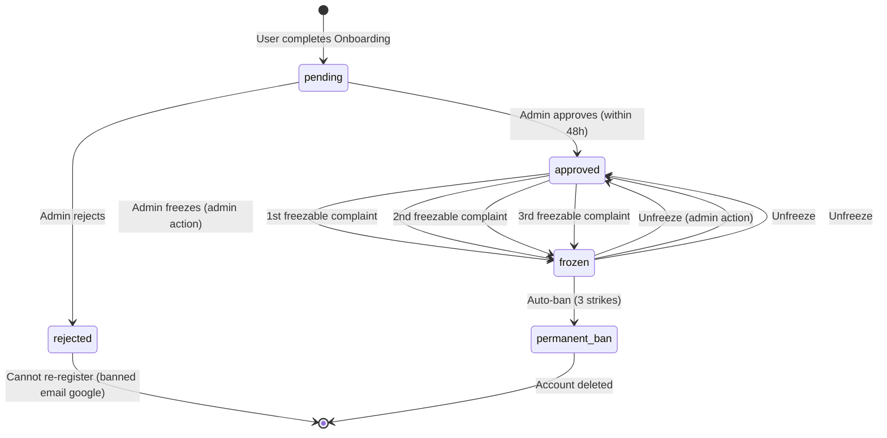

# Data Flow Diagram - Craftsman Onboarding & Approval

```mermaid
flowchart TD
    Start([ craftsman وظيفي / عميل ][Craftsman/Client]) --> Choose[اختيار نوع التسجيل]
    Choose -->|Client| GoogleOAuth[Google OAuth Login]
    Choose -->|Craftsman| CraftsmanOAuth[Google OAuth + Role: craftsman]

    GoogleOAuth -->|redirect| NextAuth[NextAuth Callback]
    CraftsmanOAuth -->|createUser| NextAuth

    NextAuth --> CreateUser[إنشاء حساب المستخدم<br/>role = client / craftsman]
    CreateUser --> CheckRole{هل Role = craftsman?}

    CheckRole -->|no| Home[الصفحة الرئيسية /]
    CheckRole -->|yes| Onboarding[Onboarding Wizard<br/>9 خطوات]

    rect rgb(240, 253, 244)
        subgraph Onboarding ["📋 Onboarding Flow"]
            Step1[1. نوع الحرفة<br/>عربي dropdown]
            Step2[2. رقم هاتف مصري<br/>E.164 format]
            Step3[3. عمره<br/>integer]
            Step4[4. سنوات خبرة<br/>integer]
            Step5[5. صورة بطاقة أمام/خلف<br/>Upload to S3]
            Step6[6. صورة وجه<br/>Face photo]
            Step7[7. وسيلة النقل<br/>bike | walking | car | minivan]
            Step8[8. صور/بيانات وسيلة النقل<br/>conditional]
            Step9[9. عنوان الورشة + Google Maps<br/>Geocoding]
        end
    end

    Onboarding --> Validate[Zod Validation<br/>كل Step]
    Validate -->|invalid| ShowErrors[عرض أخطاء]<-->Onboarding
    Validate -->|valid| SaveProfile[Save إلى craftsman_profiles<br/>status = pending]

    SaveProfile --> AuditLog[تسجيل Audit Log<br/>审アウト]
    SaveProfile --> CreateNotification[إرسال إشعار بريد إلكتروني]
    SaveProfile --> NotifyAdmin[إشعار الأدمن<br/>New registration queue]

    NotifyAdmin --> AdminDashboard[لوحة تحكم الأدمن]
    AdminDashboard --> Review{مراجعة<br/>48 hours}

    rect rgb(255, 251, 240)
        subgraph AdminReview ["👨‍💼 Admin Review"]
            ReviewDocs[مراجعة الوثائق<br/>صور البطاقة + الوجه]
            VerifyMatch[تطابق الوجه (optional)]
            CheckHistory[فحص السجل الجنائي/الخبريات (optional)]
            MakeDecision{قرار: قبول/رفض}
        end
    end

    MakeDecision -->|reject| Reject[Reject Craftsman<br/>rejection_reason]
    Reject --> SendRejection[إرسال بريد: رفض]
    SendRejection --> BanCheck{رفض نهائي?}
    BanCheck -->|yes| BlockPermanently[Ban<br/>is_deleted = true<br/>email sent]

    MakeDecision -->|approve| Approve[Approve<br/>status = approved]
    Approve --> SendApproval[إرسال بريد: قبول]
    SendApproval --> CreateInApp[إشعار داخل التطبيق]
    CreateInApp --> UnlockAccount[فتح الحساب<br/>عرض الملف العام]

    rect rgb(220, 38, 38)
        subgraph FreezeTracking ["❄️ Freeze / Ban Tracking"]
            ThreeStrikes{تجميد >= 3?}
            Freeze[تجليد مؤقت<br/>freeze_until = NOW + 30d<br/>freeze_count++]
            AutoBan[حظر تلقائي نهائي<br/>is_deleted = true]
        end
    end

    style Start fill:#10b981,color:#fff
    style Onboarding fill:#3b82f6,color:#fff
    style AdminReview fill:#f59e0b,color:#fff
    style FreezeTracking fill:#ef4444,color:#fff
    style Home fill:#10b981,color:#fff

    linkStyle 5 stroke:#10b981,stroke-width:2px
    linkStyle 12 stroke:#f59e0b,stroke-width:2px
    linkStyle 26 stroke:#ef4444,stroke-width:2px
```

---

## Onboarding Details

### Form Validation (Zod Schema)

```typescript
// features/craftsman/schemas/onboarding.schema.ts
import { z } from 'zod';

export const OnboardingStepSchema = z.object({
  step1_identity: z.object({
    craftType: z.enum([
      'carpenter', 'plumber', 'painter', 'electrician',
      'welder', 'tiler', 'ceramicist', 'whitewasher',
      'hvac', 'satellite', 'aluminum'
    ]),
    experienceYears: z.number().int().min(0).max(50),
    phone: z.string().regex(/^01[0125][0-9]{8}$/, 'Invalid Egyptian phone'),
    age: z.number().int().min(18).max(80),
  }),

  step2_documents: z.object({
    idCardFrontUrl: z.string().url('Invalid URL'),
    idCardBackUrl: z.string().url('Invalid URL'),
    facePhotoUrl: z.string().url('Invalid URL'),
  }),

  step3_transport: z.object({
    transportType: z.enum(['bike', 'walking', 'car', 'minivan']),
    transportPhotos: z.array(z.string().url()).optional(),
    vehicleNumber: z.string().regex(/^[A-Z]{2,3}[ -]?\d{3,4}$/, 'Invalid Egyptian plates').optional(),
  }).refine(data => {
    if (data.transportType !== 'car') return true;
    return !!data.vehicleNumber;
  }, { message: 'Vehicle number required for cars' }),

  step4_location: z.object({
    workshopAddress: z.string().min(10, 'Address too short'),
    workshopLatitude: z.string().refine(val => !isNaN(parseFloat(val)), 'Invalid latitude'),
    workshopLongitude: z.string().refine(val => !isNaN(parseFloat(val)), 'Invalid longitude'),
  }),
});

export type OnboardingData = z.infer<typeof OnboardingStepSchema>;
```

---

## Database Updates (Step by Step)

| Step | Action | Table | Columns Updated |
|------|--------|-------|-----------------|
| **Step 1-4** | Store basic info | `craftsman_profiles` | `craft_type`, `experience_years`, `phone`, `age` |
| **Step 5-6** | Upload documents | `craftsman_profiles` | `id_card_front_url`, `id_card_back_url`, `face_photo_url` |
| **Step 7-8** | Transport info | `craftsman_profiles` | `transport_type`, `transport_photos`, `vehicle_number` |
| **Step 9** | Location | `craftsman_profiles` | `workshop_address`, `workshop_latitude`, `workshop_longitude` |
| **Final Submit** | Complete onboarding | `craftsman_profiles` | `status = 'pending'`, `created_at`, `updated_at` |

---

## Admin Dashboard Review Queue

```
المدرج تلقائياً في الصف الأول:
1. الطلبات الجديدة (status = 'pending') — sorted by created_at ASC
2. الطلبات التي تم تغيير حالتها (تم قبولها/رفضها) — للتاريخ
```

### Review Checklist (Admin View)

| العنصر | الحالة المطلوبة | الإجراء الافتراضي |
|--------|----------------|------------------|
| **صورة البطاقة الأمامية** | واضحة + غير منتهية | ✅ مقبول |
| **صورة البطاقة الخلفية** | واضحة | ✅ مقبول |
| **صورة الوجه** | واضحة + مطابقة للاسم | ✅ مقبول |
| **وسيلة النقل ( إذا سيارة )** | صورة السيارة رقم واضح | ✅ مقبول |
| **عنوان الورشة** | يمكن تحديده على الخريطة | ✅ مقبول |
| **الخبرة** | منطقية (0-50 سنة) | ✅ مقبول |

### Rejection Reasons (Dropdown)

```typescript
export const RejectionReasons = [
  'Invalid ID card',
  'Face does not match ID',
  'Transport photo unclear',
  'Address not verifiable',
  'Suspicious behavior',
  'Incomplete information',
] as const;
```

---

## State Machine: Craftsman Status



---

## 3-Strike Rule (Automatic Ban)

```typescript
// features/complaints/use-cases/handle-complaint-result.usecase.ts
export async function handleComplaintResolution(complaint: Complaint): Promise<void> {
  const craftsman = await craftsmanRepository.findProfileByUserId(complaint.againstUserId);

  if (!craftsman || craftsman.status === 'frozen') return;

  // If action is 'freeze', increment count
  if (complaint.actionTaken === 'freeze') {
    const newFreezeCount = craftsman.freezeCount + 1;

    if (newFreezeCount >= 3) {
      // AUTO-BAN
      await craftsmanRepository.ban(craftsman.id, complaint.description);
      await emailService.sendBanNotification(craftsman.userId, complaint.description);
      await auditLogger.log({
        action: 'auto_ban_3_strikes',
        targetType: 'craftsman_profile',
        targetId: craftsman.id,
        metadata: { strikeCount: newFreezeCount, complaints: [complaint.id] },
      });
    } else {
      // Freeze for 30 days
      await craftsmanRepository.freeze(
        craftsman.id,
        addDays(new Date(), 30),
        complaint.reason
      );
      await emailService.sendFreezeNotification(craftsman.userId, 30);
    }
  }
}
```

---

## Error & Edge Cases

| Scenario | Action |
|----------|--------|
| **User abandons onboarding** | Save partial data as draft (optional) |
| **File upload fails** | Retry 3x; fallback to local storage |
| **Google Maps API down** | Manual lat/lng input; fallback to IP geolocation |
| **Admin review > 48h** | System reminder email to admin team |
| **User submits same data twice** | DB unique constraints catch duplicates |
| **Network failure during submit** | Client retries with backoff + idempotency key |

---

## Invariants (قواعد لا تُنكسر)

1. **No craftsman can have `status = 'approved'` without all 3 documents uploaded**
   - Enforced at DB level: ADD CONSTRAINT NOT NULL for:
     - `id_card_front_url`
     - `id_card_back_url`
     - `face_photo_url`
     - `workshop_latitude` + `workshop_longitude`

2. **No user can have `role = craftsman` without `craftsman_profiles` record**
   - Enforced by transaction: create user → create profile atomically

3. **No duplicate email allowed**
   - Enforced at DB level: UNIQUE constraint on `users.email`

4. **Cannot ban a user who has pending order**
   - Business rule: Admin must complete or cancel the order first

5. **Onboarding must complete within 7 days**
   - Auto-reminder after 3 days

---

## Related Documents
- [ERD](erd.md)
- [Sequence - Google OAuth](seq-google-oauth.md)
- [C4 L3 - Component](c4-l3-component-internal.md)
- [Plan](plan.md)
