# Entity Relationship Diagram (ERD) - Harfino Database Schema

```mermaid
erDiagram
    users ||--o{ craftsman_profiles : "has"
    users ||--o{ orders : "creates (as client)"
    users ||--o{ orders : "receives (as craftsman)"
    users ||--o| craftsman_locations : "has current location"
    users ||--o{ reviews : "writes"
    users ||--o{ reviews : "receives"
    users ||--o{ complaints : "files"
    users ||--o{ complaints : "is against"
    users ||--o{ notifications : "receives"
    users ||--o{ audit_logs : "performs"
    orders ||--o| reviews : "has"
    orders ||--o{ complaints : "has"
    users ||--o{ admin_reviews : "reviews by (admin)"

    users {
        uuid id PK "السجل الأساسي"
        text email UK "بريد Google"
        boolean email_verified
        text name
        text image
        text google_id UK "معرّف Google"
        text role "client | craftsman | admin | super_admin"
        text phone "رقم هاتف مصري (10 digits)"
        integer age "العمر"
        timestamp created_at
        timestamp updated_at
        timestamp banned_at "تاريخ الحظر"
        boolean is_deleted "Soft Delete"
    }

    craftsman_profiles {
        uuid id PK
        uuid user_id FK "→ users.id"
        text craft_type "carpenter | plumber | painter | electrician | welder | tiler | ceramicist | whitewasher | hvac | satellite | aluminum"
        integer experience_years
        text id_card_front_url UK "صورة وج서 بطاقة"
        text id_card_back_url "صورة ظهر بطاقة"
        text face_photo_url "صورة الوجه"
        text transport_type "bike | walking | car | minivan"
        jsonb transport_photos "[صفور وسيلة نقل]"
        text vehicle_number "رقم السيارة (if car)"
        text workshop_address "عنوان الورشة/المنزل"
        text workshop_latitude UK "إحداثيات مع Google Maps"
        text workshop_longitude UK "إحداثيات مع Google Maps"
        boolean is_available "متاح الآن"
        boolean is_online "متصل (Realtime)"
        text status "pending | approved | rejected | frozen"
        timestamp freeze_until "تاريخ انتهاء التجميد"
        text freeze_reason "سبب التجميد"
        integer freeze_count "عدد التجميدات (3 Strikes)"
        text rejection_reason "سبب الرفض"
        uuid reviewed_by FK "→ users.id (Admin)"
        timestamp reviewed_at
        timestamp created_at
        timestamp updated_at
    }

    craftsman_locations {
        uuid id PK
        uuid user_id FK "→ users.id"
        text latitude "خط العرض (Realtime)"
        text longitude "خط الطول (Realtime)"
        timestamp last_updated "آخر تحديث"
        boolean is_available "متاح أم لا"
    }

    orders {
        uuid id PK
        uuid client_id FK "→ users.id (Client)"
        uuid craftsman_id FK "→ users.id (Craftsman)"
        text craft_type "نوع الحرفة"
        text status "pending | accepted | rejected | in_progress | completed | cancelled"
        text description "وصف الخدمة المطلوبة"
        text address "عنوان التنفيذ"
        text latitude
        text longitude
        text estimated_price
        text final_price
        timestamp scheduled_at
        timestamp completed_at
        boolean client_accepted_final_price
        timestamp created_at
        timestamp updated_at
    }

    reviews {
        uuid id PK
        uuid order_id FK "→ orders.id"
        uuid client_id FK "→ users.id"
        uuid craftsman_id FK "→ users.id"
        integer rating "1-5 نجوم"
        text comment
        timestamp created_at
    }

    complaints {
        uuid id PK
        uuid order_id FK "→ orders.id"
        uuid reporter_id FK "→ users.id (الـ Client)"
        uuid against_user_id FK "→ users.id (المحتَمل على الحرفي)"
        text reason "no_show | bad_service | overpriced | harassment | fraud | other"
        text description "وصف الشكوى"
        jsonb evidence_urls "[صور/فيديوهات أدلة]"
        text status "pending | investigating | resolved | dismissed"
        text action_taken "warning | freeze | permanent_ban"
        uuid resolved_by FK "→ users.id (Admin)"
        timestamp resolved_at
        timestamp created_at
        timestamp updated_at
    }

    notifications {
        uuid id PK
        uuid user_id FK "→ users.id"
        text type "email | in_app | push"
        text title
        text body
        boolean read
        timestamp read_at
        timestamp sent_at
    }

    audit_logs {
        uuid id PK
        uuid actor_id FK "→ users.id"
        text action "approve_craftsman | reject_craftsman | freeze_user | ban_user | ..."
        text target_type "craftsman_profile | complaint | order | review | ..."
        text target_id
        jsonb metadata "{userId, adminId, reason, oldValues, newValues}"
        timestamp created_at
    }

    admin_reviews {
        uuid id PK
        uuid admin_id FK "→ users.id (Admin)"
        uuid target_user_id FK "→ users.id (المُختَبَر)"
        uuid target_type "user | craftsman_profile | complaint | review"
        text target_id
        text decision "approved | rejected | frozen | warned | banned"
        text notes "ملاحظات الأدمن"
        text rejection_reason "سبب الرفض"
        timestamp created_at
    }

    webhooks {
        uuid id PK
        text event "craftsman.approved | order.created | craftsman.banned | ..."
        text url "Target URL"
        text secret "HMAC Signature Secret"
        boolean is_active
        integer retry_count
        timestamp last_triggered_at
        timestamp created_at
    }
```



---

## Indexes (Critical for Performance)

```sql
-- Craftsman search by craft type + availability
CREATE INDEX idx_cp_craft_status ON craftsman_profiles (craft_type, is_available) WHERE status = 'approved';
CREATE INDEX idx_cp_user_id ON craftsman_profiles (user_id);
CREATE INDEX idx_cp_status ON craftsman_profiles (status);
CREATE INDEX idx_cp_craft_exp ON craftsman_profiles (craft_type, experience_years DESC);

-- Order management
CREATE INDEX idx_orders_client ON orders (client_id);
CREATE INDEX idx_orders_craftsman ON orders (craftsman_id);
CREATE INDEX idx_orders_status ON orders (status);
CREATE INDEX idx_orders_crane ON orders (craftsman_id, status) WHERE status IN ('pending', 'accepted');

-- Real-time location updates
CREATE INDEX idx_cl_user ON craftsman_locations (user_id);
CREATE INDEX idx_cl_availability ON craftsman_locations (is_available, last_updated DESC);

-- Reviews aggregation for ranking
CREATE INDEX idx_reviews_craftsman ON reviews (craftsman_id);
CREATE INDEX idx_reviews_rating ON reviews (craftsman_id, rating DESC, created_at DESC);
CREATE INDEX idx_r_order ON reviews (order_id) UNIQUE;

-- Complaints tracking
CREATE INDEX idx_complaints_status ON complaints (status);
CREATE INDEX idx_complaints_against ON complaints (against_user_id, status);
CREATE INDEX idx_complaints_rapid ON complaints (reporter_id, created_at DESC);

-- Notifications
CREATE INDEX idx_n_user ON notifications (user_id, read, created_at DESC);

-- Audit logs
CREATE INDEX idx_audit_action ON audit_logs (action, created_at DESC);
CREATE INDEX idx_audit_actor ON audit_logs (actor_id, created_at DESC);
CREATE INDEX idx_audit_target ON audit_logs (target_type, target_id);

-- Admin reviews
CREATE INDEX idx_admin_reviews_target ON admin_reviews (target_user_id, created_at DESC);
```

---

## Foreign Key Constraints & Cascade Rules

```sql
-- Users (root entity)
ALTER TABLE users ADD CONSTRAINT fk_users_id PRIMARY KEY (id);

-- Craftsman Profiles
ALTER TABLE craftsman_profiles ADD CONSTRAINT fk_cp_user
  FOREIGN KEY (user_id) REFERENCES users(id) ON DELETE CASCADE;

-- On delete cascade: if user is deleted, profile is deleted too

-- Orders
ALTER TABLE orders ADD CONSTRAINT fk_orders_client
  FOREIGN KEY (client_id) REFERENCES users(id) ON DELETE CASCADE;
ALTER TABLE orders ADD CONSTRAINT fk_orders_craftsman
  FOREIGN KEY (craftsman_id) REFERENCES users(id) ON DELETE SET NULL;
-- On delete: order is preserved but craftsman_id becomes NULL

-- Reviews
ALTER TABLE reviews ADD CONSTRAINT fk_reviews_order
  FOREIGN KEY (order_id) REFERENCES orders(id) ON DELETE CASCADE;
-- On delete cascade: if order is deleted, review is deleted too

-- Complaints
ALTER TABLE complaints ADD CONSTRAINT fk_complaints_order
  FOREIGN KEY (order_id) REFERENCES orders(id) ON DELETE SET NULL;
ALTER TABLE complaints ADD CONSTRAINT fk_complaints_reporter
  FOREIGN KEY (reporter_id) REFERENCES users(id) ON DELETE CASCADE;
ALTER TABLE complaints ADD CONSTRAINT fk_complaints_against
  FOREIGN KEY (against_user_id) REFERENCES users(id) ON DELETE CASCADE;

-- Notifications
ALTER TABLE notifications ADD CONSTRAINT fk_notifications_user
  FOREIGN KEY (user_id) REFERENCES users(id) ON DELETE CASCADE;

-- Audit Logs
ALTER TABLE audit_logs ADD CONSTRAINT fk_audit_actor
  FOREIGN KEY (actor_id) REFERENCES users(id) ON DELETE SET NULL;

-- Admin Reviews
ALTER TABLE admin_reviews ADD CONSTRAINT fk_ar_admin
  FOREIGN KEY (admin_id) REFERENCES users(id) ON DELETE SET NULL;
ALTER TABLE admin_reviews ADD CONSTRAINT fk_ar_target_user
  FOREIGN KEY (target_user_id) REFERENCES users(id) ON DELETE CASCADE;

-- Unique Constraints
ALTER TABLE craftsman_profiles ADD CONSTRAINT uq_cp_user UNIQUE (user_id);
ALTER TABLE craftsman_locations ADD CONSTRAINT uq_cl_user UNIQUE (user_id);
ALTER TABLE reviews ADD CONSTRAINT uq_r_order UNIQUE (order_id);
```

---

## Data Model Decisions (Design Rationale)

| Decision | Rationale |
|----------|-----------|
| **UUIDs for all PKs** | безопасный لـ distributed systems، لا يحدث collision، مناسب للـ external APIs |
| **text for lat/lng** | Precision: PostgreSQL NUMERIC(10,7) or text with constraints |
| **JSONB for photos** | Flexible: transport_photos array of URLs |
| **ENUM types for status** | Database-level validation + type safety in Drizzle |
| **soft delete (is_deleted)** | Audit trail + preservation of foreign key references |
| **Composite unique (craft_type, workshop_lat, lng)** | Prevent duplicate workshop registration |
| **User role as column** | Simpler than separate tables; easier to JOIN for dashboards |

---

## Database Schema Changes (Future)

| Version | Change | Migration Strategy |
|---------|--------|-------------------|
| **v2.0** | Add `features` table for premium services | Additive (nullable) |
| **v2.0** | Add `chat_messages` for in-app chat | Additive |
| **v2.1** | Add `payment_methods` table for future payments | Additive |
| **v3.0** | Add `rating_summary` materialized view for faster ranking | Non-breaking, rebuildable |

---

## ERD Tools

- **Online**: dbdiagram.io, QuickDBD
- **Desktop**: Draw.io, DBeaver
- **Code-first**: Drizzle Kit generates migrations from TS schema
- **Export to SQL**: `drizzle-kit generate:pg` generates SQL from TypeScript schema

---

## Related Documents
- [Database Schema](/libs/db/schema.ts)
- [Plan](plan.md)
- [Drizzle ORM Docs](https://orm.drizzle.team/docs/overview)
- [PostgreSQL Concurrency](https://www.postgresql.org/docs/current/mvcc.html)
