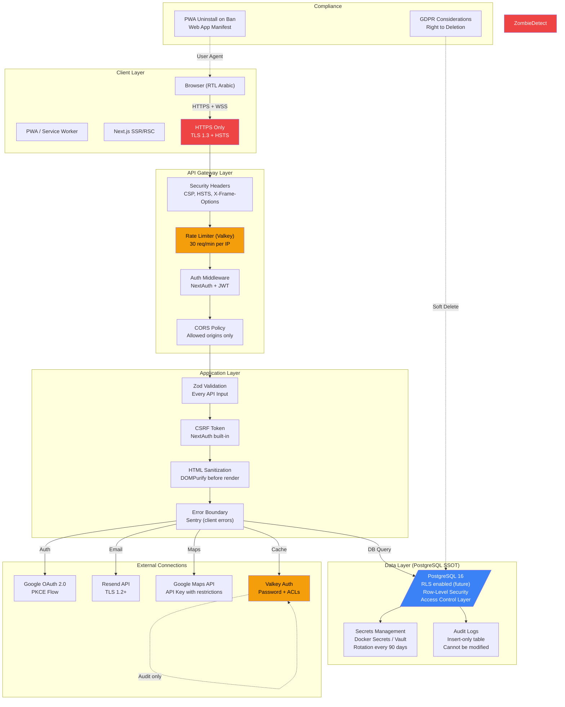

# Security Architecture - Harfino



---

## Security Implementation

### Authentication & Authorization

```typescript
// middleware.ts
import { auth } from '@/lib/auth/options';
import { NextResponse } from 'next/server';
import { z } from 'zod';

const RateLimitSchema = z.object({
  limit: z.number().min(1),
  windowMs: z.number().min(1000),
});

export function rateLimiter(key: string, maxAttempts: number, windowMs: number) {
  return async (req: Request) => {
    const identifier = req.headers.get('x-forwarded-for') || 'unknown';
    // Use nextjs-middleware
    const result = await checkRateLimit(identifier, maxAttempts, windowMs);
    if (!result.success) {
      return NextResponse.json(
        { error: 'Too many requests' },
        { status: 429, headers: { 'Retry-After': String(Math.ceil(windowMs / 1000)) } }
      );
    }
    return NextResponse.next();
  };
}

export default auth(async (req) => {
  const session = req.auth;

  // Route-based auth
  const protectedRoutes = ['/api/admin', '/dashboard'];
  if (protectedRoutes.some(p => req.nextUrl.pathname.startsWith(p))) {
    if (!session || session.user.role !== 'admin') {
      return NextResponse.redirect(new URL('/unauthorized', req.url));
    }
  }

  // Craftsman onboarding guard
  if (req.nextUrl.pathname.startsWith('/dashboard/craftsman')) {
    const profile = await craftsmanRepository.findProfileByUserId(session?.user.id);
    if (!profile || profile.status === 'rejected') {
      return NextResponse.redirect(new URL('/access-denied', req.url));
    }
  }

  return NextResponse.next();
});
```

### Input Validation (Zod) & Sanitization

```typescript
// base.schemas.ts
import { z } from 'zod';
import DOMPurify from 'isomorphic-dompurify';

// Input validation schemas for every API
export const BaseSchemas = {
  // Sanitize all text inputs
  sanitizedString: z.string().transform(val => DOMPurify.sanitize(val)),
  
  // Phone validation (Egyptian)
  egyptianPhone: z.string().regex(/^01[0125][0-9]{8}$/),
  
  // Coordinates
  latitude: z.coerce.number().min(-90).max(90),
  longitude: z.coerce.number().min(-180).max(180),
  
  // URL validation for uploaded files
  s3Url: z.string().url().includes('s3.amazonaws.com'),
  
  // Pagination
  pagination: z.object({
    page: z.coerce.number().int().min(1).default(1),
    limit: z.coerce.number().int().min(1).max(100).default(20),
  }),
};
```

### CSRF Protection

```typescript
// Next.js Middleware handles CSRF automatically
// For form submissions, use NextAuth's built-in CSRF token
// For multipart/form-data (file uploads via FormData), NextAuth is bypassed - use custom CSRF

import csrf from 'csurf';
import cookie from 'cookie';

export function csrfProtection() {
  const csrfProtection = csrf({ cookie: true });
  
  return (req: Request) => {
    // Generate CSRF token and set as cookie
    const token = csrfProtection(req);
    // Send token as header for fetch requests
    return NextResponse.json({ csrfToken: token });
  };
}
```

### Content Security Policy (CSP)

```typescript
// next.config.js
const securityHeaders = [
  {
    key: 'Content-Security-Policy',
    value: [
      "default-src 'self'",
      "script-src 'self' 'unsafe-inline' https://cdn.tailwindcss.com",
      "style-src 'self' 'unsafe-inline' https://fonts.googleapis.com",
      "font-src 'self' https://fonts.gstatic.com",
      "img-src 'self' blob: data: https:",
      "connect-src 'self' wss://realtime.herafino.com https://api.resend.com https://maps.googleapis.com",
      "frame-ancestors 'none'",
      "upgrade-insecure-requests",
    ].join('; '),
  },
  { key: 'Strict-Transport-Security', value: 'max-age=63072000; includeSubDomains; preload' },
  { key: 'X-Frame-Options', value: 'DENY' },
  { key: 'X-Content-Type-Options', value: 'nosniff' },
  { key: 'X-XSS-Protection', value: '1; mode=block' },
  { key: 'Referrer-Policy', value: 'strict-origin-when-cross-origin' },
  { key: 'Permissions-Policy', value: 'geolocation=(self), camera=(self), microphone=()' },
];

module.exports = {
  async headers() {
    return [{ source: '/(.*)', headers: securityHeaders }];
  },
};
```

### Rate Limiting (Valkey)

| Endpoint | Rate Limit | Purpose |
|----------|-----------|---------|
| `/api/auth/*` | 10 req/min | Prevent brute force OAuth |
| `/api/craftsmen` | 60 req/min | Public search |
| `/api/orders` | 30 req/min | Client creating orders |
| `/api/requests/*` | 30 req/min | Generic API |
| `/api/webhooks` | 100 req/min | Internal webhook endpoint |
| `/api/location` | 300 req/min | Realtime location updates (Valkey rate) |

```typescript
// libs/security/rate-limiter.ts
export class HttpRateLimiter {
  constructor(private valkey: ValkeyClient, private keyPrefix: string = '') {}

  async check(key: string, maxAttempts: number, windowMs: number): Promise<boolean> {
    const rateKey = `${this.keyPrefix}:${key}`;
    const windowSeconds = Math.ceil(windowMs / 1000);
    
    const result = await this.valkey.eval(`
      local key = KEYS[1]
      local max = tonumber(ARGV[1])
      local window = tonumber(ARGV[2])
      local current = redis.call('GET', key)
      if current == nil then
        current = 0
        redis.call('SET', key, 1, 'EX', window)
        return 1
      end
      current = tonumber(current) + 1
      redis.call('SET', key, current, 'EX', window)
      return current <= max and 1 or 0
    `, 1, rateKey, maxAttempts, windowSeconds);

    return result === 1;
  }
}
```

### PWA Security

```typescript
// next.config.js
const withPWA = require('next-pwa')({
  dest: 'public',
  register: true,
  skipWaiting: true,
  runtimeCaching: [
    {
      urlPattern: /^https:\/\/.*\.herafino\.com\/api\/.*/,
      handler: 'NetworkFirst",
      options: {
        networkTimeoutSeconds:quot;5,
        cacheName: 'api-cache',
        expiration: { maxEntries: 1000, maxAgeSeconds: 3600 },
      },
    },
    {
      urlPattern: /^https:\/\/.*\.herafino\.com\//,
      handler: 'NetworkFirst',
      options: {
        cacheName: 'pages',
        expiration: { maxEntries: 200, maxAgeSeconds: 86400 },
      },
    },
  ],
});

module.exports = withPWA({});
```

### Logging & Auditing (Pino)

```typescript
// libs/logger/factory.ts
import pino from 'pino';
import { randomUUID } from 'crypto';

export const logger = pino({
  level: process.env.LOG_LEVEL || 'info',
  formatter: (log) => ({
    ...log,
    timestamp: new Date().toISOString(),
    service: 'herafino',
    env: process.env.NODE_ENV,
    requestId: randomUUID(),
  }),
  transport: process.env.NODE_ENV === 'development'
    ? { target: 'pino-pretty' }
    : undefined,
});

// Audit logging (must be immutable)
export class AuditLogger {
  async log(event: AuditEvent) {
    await auditLogRepository.create({
      actorId: event.actorId,
      action: event.action,
      targetType: event.targetType,
      targetId: event.targetId,
      metadata: event.metadata,
      createdAt: new Date(),
    });
  }
}
```

### OS-Level Security (Linux)

```bash
# /etc/security/limits.conf
# Prevent resource exhaustion
nextjs hard nofile 65536
nextjs soft nofile 65536
postgres hard nofile 65536
postgres soft nofile 65536

# sysctl.conf
net.core.somaxconn = 1024
net.ipv4.tcp_syncookies = 1
vm.overcommit_memory = 1
kernel.randomize_va_space = 2
```

### Encryption & Secrets

| Secret | Storage | Rotation |
|--------|---------|----------|
| **Google OAuth secret** | Docker secrets / Vault | 180 days |
| **Resend API key** | Env var (secret) | 90 days |
| **Database password** | Docker secrets | 90 days |
| **Valkey password** | Docker secrets | 90 days |
| **Webhook secrets** | API + DB encrypted | Per webhook |
| **JWT signing key** | .env.local + Vault | 90 days |

### Threat Model

| Threat | Likelihood | Impact | Mitigation |
|--------|-----------|--------|-----------|
| **SQL Injection** | Low | High | Drizzle ORM parameterized queries |
| **XSS** | Medium | High | DOMPurify, CSP |
| **CSRF** | Medium | Medium | NextAuth CSRF protection |
| **Brute Force OAuth** | Low | Low | Rate limiting + Valkey |
| **DDoS** | Medium | Medium | WAF + Rate Limiting + Cloudflare (optional) |
| **Man-in-the-Middle** | Low | High | HTTPS only + HSTS |
| **Data Leakage** | Low | Critical | Audit logs + GDPR compliance |
| **Replay Attack (Webhooks)** | Low | Medium | Timestamp + HMAC signature |
| **Race Condition (Double Booking)** | Medium | High | Distributed Lock + Postgres Constraints |

---

## Security Headers (Server-side)

```typescript
// next.config.js
const securityHeaders = [
  { key: 'X-DNS-Prefetch-Control', value: 'on' },
  { key: 'Strict-Transport-Security', value: 'max-age=63072000; includeSubDomains; preload' },
  { key: 'X-Frame-Options', value: 'DENY' },
  { key: 'X-Content-Type-Options', value: 'nosniff' },
  { key: 'X-XSS-Protection', value: '1; mode=block' },
  { key: 'Referrer-Policy', value: 'strict-origin-when-cross-origin' },
  { key: 'Permissions-Policy', value: 'geolocation=(self), camera=(self), microphone=()' },
];

module.exports = {
  async headers() {
    return [
      {
        source: '/(.*)',
        headers: securityHeaders,
      },
    ];
  },
};
```

---

## Security Checklist (Pre-Deployment)

### Application Layer
- [ ] All user inputs validated with Zod
- [ ] Drizzle ORM parameterized queries (no SQL strings)
- [ ] PII data encrypted at rest (optional but recommended)
- [ ] Audit logs are insert-only, no UPDATE/DELETE allowed

### Infrastructure Layer
- [ ] PostgreSQL `pg_hba.conf` restricts access by IP
- [ ] Valkey ACL + password authentication
- [ ] No default passwords in production
- [ ] TLS 1.3 enforced for all external connections
- [ ] SSH key-based auth (no password login)
- [ ] Linux firewall (UFW/iptables) restricts ports

### External Services
- [ ] Google OAuth uses PKCE flow
- [ ] Resend API key has least-privilege permissions
- [ ] Google Maps API key restricted to domain names
- [ ] Sentry DSN not exposed in client-side code

### Monitoring
- [ ] All auth events logged (login, logout, failed auth)
- [ ] Rate limiting metrics exported to Prometheus
- [ ] Error tracking (Sentry) alerts on critical errors
- [ ] Security logs separated from application logs

---

## Privacy & Compliance (GDPR Considerations)

| Requirement | Implementation |
|-------------|----------------|
| **Right to be Forgotten** | `is_deleted = true` on users; cascade to related data |
| **Data Portability** | Export endpoint for user data (JSON/CSV) |
| **Consent** | Google OAuth consent screen handled by Google |
| **Breach Notification** | Sentry alerts → Admin email notification |
| **Audit Trail** | Immutable audit_logs table |

---

## Related Documents
- [C4 L1 - System Context](c4-l1-system-context.md)
- [C4 L2 - Container](c4-l2-container-deployment.md)
- [Monitoring Architecture](monitoring-architecture.md)
- [Plan](plan.md)
