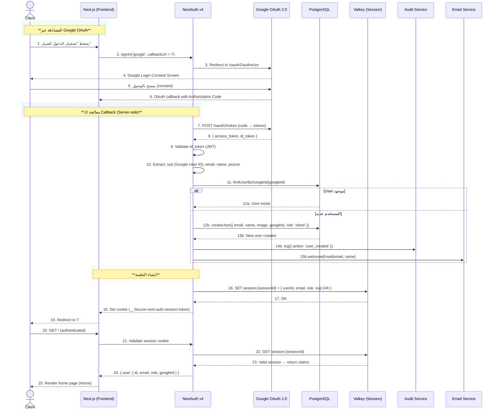
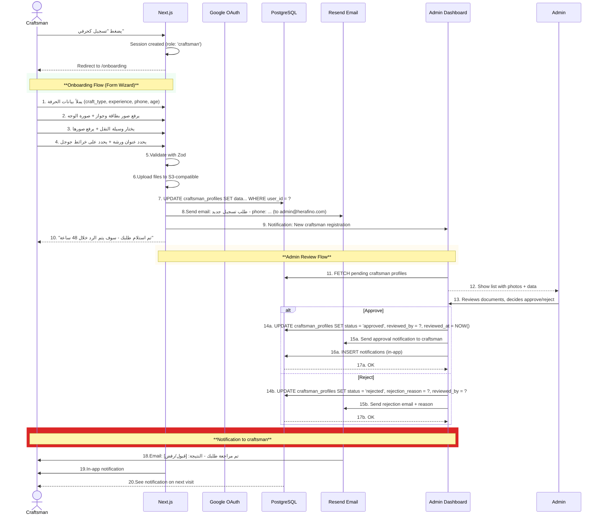

# Sequence Diagram - Google OAuth Login



---

## Flow Steps Breakdown

### 1. Trigger - Client clicks sign-in

```
المستخدم: clicks "Sign in with Google" button
النظام: Next.js + NextAuth initiates OAuth flow
URL Pattern: /api/auth/signin?callbackUrl=/
```

### 2. OAuth Authorization

```
NextAuth → GET https://accounts.google.com/o/oauth2/v2/auth
  - client_id: NEXT_PUBLIC_GOOGLE_CLIENT_ID
  - redirect_uri: https://harfino.com/api/auth/callback/google
  - response_type: code
  - scope: openid profile email
  - access_type: offline
  - prompt: consent
```

### 3. User Consent

```
User sees Google consent screen:
  - "Harfino wants to access your email and profile"
  - User clicks "Continue"
  - Google redirects back to callback URL with `code`
```

### 4. Token Exchange

```
NextAuth → POST https://oauth2.googleapis.com/token
  Body: { grant_type: 'authorization_code', code: <callback_code>, ... }
  Response: { access_token, id_token, expires_in, refresh_token }
```

### 5. JWT Validation

```
NextAuth validates id_token:
  - Verify signature (Google's public key)
  - Verify issuer (accounts.google.com)
  - Verify audience (client_id)
  - Verify expiration
  - Extract claims: sub, email, email_verified, name, picture
```

### 6. User Lookup/Creation (Database Function)

```typescript
// features/auth/use-cases/handle-google-callback.usecase.ts
export async function handleGoogleCallback(googleUser: GoogleUser): Promise<User> {
  const existingUser = await userRepository.findByGoogleId(googleUser.sub);

  if (existingUser) {
    auditLogger.log({
      actorId: existingUser.id,
      action: "user_login",
      targetType: "user",
      targetId: existingUser.id,
      metadata: { method: "google_oauth" },
    });
    return existingUser;
  }

  const newUser = await userRepository.create({
    email: googleUser.email,
    emailVerified: googleUser.email_verified,
    name: googleUser.name,
    image: googleUser.picture,
    googleId: googleUser.sub,
    role: "client", // default role
  });

  auditLogger.log({
    actorId: newUser.id,
    action: "user_created",
    targetType: "user",
    targetId: newUser.id,
    metadata: { method: "google_oauth" },
  });

  return newUser;
}
```

### 7. Session Storage (Valkey)

```typescript
// Session structure (Redis/Valkey)
{
  sessionId: "abc123",
  userId: "user-uuid",
  email: "ahmed@example.com",
  role: "client",
  googleId: "google-user-id",
  exp: 1719784800, // Unix timestamp
  iat: 1719781200,
}

// Valkey Key Pattern: session:<sessionId>
// TTL: 24 hours
```

### 8. Next.js Proxy Flow (Subsequent Requests)

```typescript
// proxy.ts
import { auth } from "@/app/auth";

export default auth((req) => {
  const session = req.auth;

  // Check if user is authenticated
  if (!session) {
    return NextResponse.redirect(new URL("/login", req.url));
  }

  // Role-based access
  if (req.nextUrl.pathname.startsWith("/admin") && session.user.role !== "admin") {
    return NextResponse.redirect(new URL("/unauthorized", req.url));
  }

  // Craftsman onboarding check
  if (session.user.role === "craftsman") {
    const hasCompletedOnboarding = await checkOnboarding(session.user.id);
    if (!hasCompletedOnboarding && !req.nextUrl.pathname.startsWith("/onboarding")) {
      return NextResponse.redirect(new URL("/onboarding", req.url));
    }
  }

  return NextResponse.next();
});
```

---

## Craftsman OAuth Flow (Different Branch)



---

## Craftsman Login vs Client Login

| الميزة                    | طالب حرفة (Client) | حرفي (Craftsman)                         |
| ------------------------- | ------------------ | ---------------------------------------- |
| **OAuth Provider**        | Google             | Google (نفس)                             |
| **Default Role**          | `client`           | `craftsman`                              |
| **Onboarding Required**   | لا                 | نعم                                      |
| **Admin Review Required** | لا                 | نعم (حتى 48 ساعة)                        |
| **Redirect after Login**  | `/` (Home)         | `/onboarding` أو `/` (حسب الحالة)        |
| **Registration Email**    | لا                 | لا (ترسل فقط عند الانتهاء من Onboarding) |
| **Approval Email**        | لا                 | نعم                                      |
| **Profile Visibility**    | Public             | Conditional (pending/reviewing/approved) |
| **Can create orders**     | نعم                | لا (لا يمكنه طلب خدمات لنفسه)            |

---

## Error Handling & Edge Cases

| Scenario                                                            | Action                                                 |
| ------------------------------------------------------------------- | ------------------------------------------------------ |
| **Google Account already exists**                                   | Reject with "email already exists" message             |
| **Google Account linked to deleted user**                           | Reactivate user or create new account                  |
| **Network error during callback**                                   | Retry 3x, then show "Please try again" page            |
| **Expired authorization code**                                      | Restart OAuth flow; show error message                 |
| **Valkey down**                                                     | Fallback to database session lookup (slower but works) |
| **User clicks "Sign in with Craftsman" then "Sign in with Client"** | Role switch handled in database; session re-created    |

---

## Security Considerations

| Attack Vector                       | Mitigation                                 |
| ----------------------------------- | ------------------------------------------ |
| **CSRF on /callback**               | NextAuth state parameter + PKCE            |
| **ID Token Tampering**              | Google Public Key verification (JWT lib)   |
| **Session Replay**                  | Session TTL (24h) + Redis SET with NX flag |
| **Race condition (duplicate user)** | DB unique constraint on `google_id`        |
| **XSS via saved user name**         | Sanitize user input before storing to DB   |
| **OAuth Code Injection**            | Use PKCE (Proof Key for Code Exchange)     |

---

## NextAuth Configuration

```typescript
// libs/config/auth-options.ts
import NextAuth from "next-auth";
import Google from "next-auth/providers/google";

export const { handlers, auth, signIn, signOut } = NextAuth({
  providers: [
    Google({
      clientId: process.env.GOOGLE_CLIENT_ID!,
      clientSecret: process.env.GOOGLE_CLIENT_SECRET!,
      authorization: { params: { prompt: "consent", access_type: "offline" } },
    }),
  ],
  callbacks: {
    async jwt({ token, account, profile }) {
      if (account && profile) {
        token.googleId = profile.sub;
        token.email = profile.email;
        token.name = profile.name;
        token.picture = profile.picture;
        token.emailVerified = profile.email_verified;
      }
      return token;
    },
    async session({ session, token }) {
      session.user.googleId = token.googleId as string;
      session.user.emailVerified = token.emailVerified as boolean;
      return session;
    },
  },
  events: {
    async signIn({ user }) {
      auditLogger.info({ userId: user.id, event: "user_login" });
    },
  },
  pages: {
    signIn: "/login",
  },
  session: { strategy: "jwt" },
});
```

---

## Related Documents

- [Authorization Flow](data-flow-onboarding.md)
- [Admin Review Sequence](seq-admin-review.md تيار غير مذكور) ← Replace
- [ADR-004: Choosing NextAuth](adr/)
- [ERD](erd.md)
- [Middleware Strategy](caching-strategy.md)
