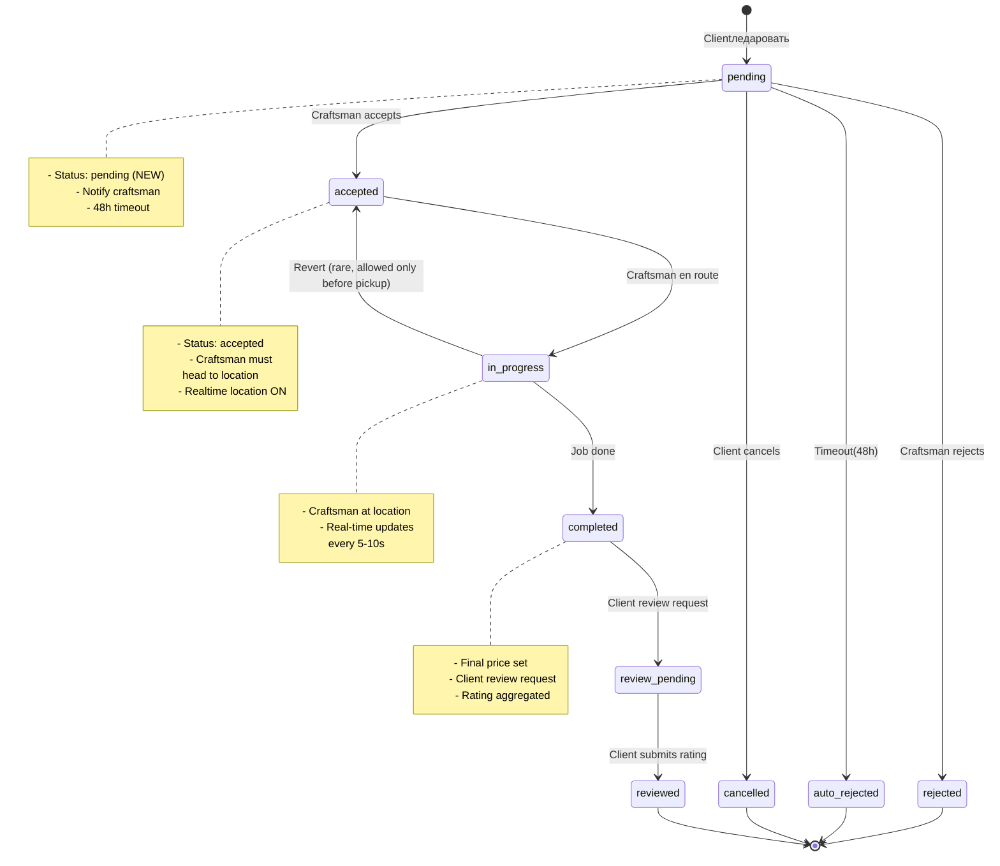
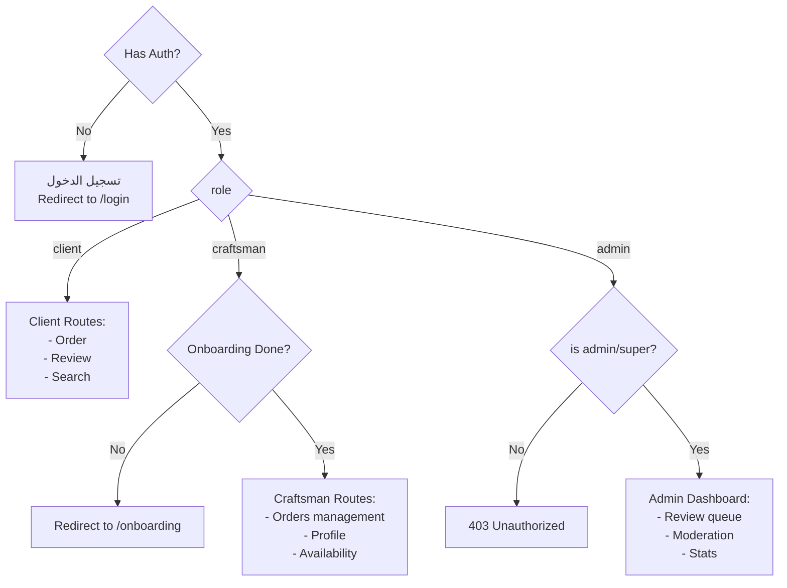

# User Flows - Harfino (RTL Arabic)

<details>
  <summary><strong>📌 Legend</strong></summary>
  <ul>
    <li>🟢 <strong>Green (Start/End)</strong>: بداية أو نهاية</li>
    <li>🔵 <strong>Blue (Decision)</strong>: قرار أو شرط</li>
    <li>🟡 <strong>Yellow (Action)</strong>: فعل أو مهمة</li>
    <li>🔴 <strong>Red (End/Stop)</strong>: هدف نهائي أو إجراء حاد</li>
    <li>➡️ <strong>Arrow</strong>: كي ↙ انتظار أو إعادة توجيه</li>
  </ul>
</details>

---

## 1. 🧑‍🔧 Craftsman (حرفي) Registration Flow

```mermaid
flowchart TD
    Start([🍋 بداية]) --> CraftSign[صفحة تسجيل الدخول - يضغط "حرفي"]

    CraftSign --> GoogleAuth[Google OAuth<br/>تسجيل دخول]
    GoogleAuth --> CreateAccount[حساب جديد يُنشأ<br/>role: craftsman, status: pending]
    CreateAccount --> Onboarding[تحويل مباشر إلى:/pages/onboarding]

    rect rgb(240, 253, 244)
        subgraph大步 "📋 Onboarding Wizard"
            Step1[1. نوع الحرفة<br/>dropdown]
            Step2[2. رقم هاتف مصري<br/>E.164 تحقق]
            Step3[3. العمر<br/>integer ]
            Step4[4. سنوات الخبرة<br/>integer ]
            Step5[5. صور البطاقة<br/>صورة أمام/ظهر]
            Step6[6. صورة الوجه<br/>تحميل]
            Step7a[7. وسيلة النقل<br/>عجلة / مشي / سيارة / نصف نقل
            Step7b{إذا سيارة?<br/>رقم السيارة + الصور}
            Step8a[8. عنوان الورشة<br/>كتابة + بحث]
            Step8b[9. تحديد على Google Maps<br/>Geocoding]
        end
    end

    Step1 --> ZodValidate[Validação مع Zod<br/>Validate every step]
    ZodValidate -->|invalid| ShowErrors[عرض أخطاء]<-->答复
    ZodValidate -->|valid往| SaveProfile[حفظ البيانات<br/>craftsman_profiles.status=pending]
    SaveProfile --> AuditLog[تسجيل Audit Log]<br/يُحفّظ في القاعدة

    SaveProfile --> SendEmail[إرسال بريد إلكتروني<br/>إلى Admin + الم craftsman]
    SendEmail --> Notifyadmin[إشعار الأدمن<br/>لوحة تحكم]
    Notifyadmin --> AdminReview{مراجعة الأدمن<br/>خلال 48 ساعة }

    AdminReview -->|reject| RejectProfile[حالات]<br/>status=rejected<br/>البريد الرفض + سبب<br/>لا يمكن تسجيل مرة أخرى
    AdminReview -->|approve| ApproveProfile[Accept<br/>status=approved]
    ApproveProfile --> SendApprove[إرسال بريد قبول<br/>إشعار Toast]
    SendApprove --> Dashboard[لوحة تحكم الحرفي<br/>عرض الملف العام]

    RejectProfile --> Blocked([🔴 الكتلة)])

    Dashboard --> ToggleAvail[تبديل حالة التوفر<br/>متاح/غير متاح]
    ToggleAvail --> StartLocation[تحديث الموقع الحالي<br/>WS connection + Geocoding]
    StartLocation --> End([🍁 النهاية])

    style Start fill:#10b981,color:white
    style Onboarding fill:#3b82f6,color:white
    style SendEmail fill:#8b5cf6,color:white
    style ApproveProfile fill:#10b981,color:white
    style RejectProfile fill:#ef4444,color:white
    style Blocked fill:#ef4444,color:white
```

---

## 2. 👤 Client (طالب حرفة) Flow

```mermaid
flowchart TD
    Start([🍋 بداية]) --> ClientLogin[تسجيل الدخول كعميل<br/>Google OAuth - بدون صفحة إضافية]
    ClientLogin -->|بعد  redirect inmediato| Home[الصفحة الرئيسية]<br/عرض <h1> "حرفينو" <br/>Search bar: بحث بالحرفة + الموقع

    Home --> SubmitSearch[العثور على حرفي<br/>- نوع الحرفة<br/>- الموقع الجغرافي]

    SubmitSearch --> Query[system query:<br/>البحث عن Craft + الموقع + isAvailable=true]
    Query --> CacheCheck[فحص Valkey Cache<br/>TTL: 2m]
    CacheCheck -->|Hit| CachedResult[B原位Data]
    CacheCheck -->|Miss| DBQuery[PostGres Query<br/>PostGIS ]
    DBQuery --> UpdateCache[set Valkey cache]
    UpdateCache --> DisplayResults[عرض قائمة الحرفيين<br/> الذين قاموا بتحديد<br/> المتاح = true]

    DisplayResults --> SelectCraftsman[العميل<br/>يختار حرفي → "طلب خدمة"]

    SelectCraftsman --> LoadForm[ نموذج الطلب]<br/>- الوصف<br/>- الموقع<br/>- السعر المقدر
    LoadForm --> SubmitOrder[إرسال طلب<br/>OrderPage]

    SubmitOrder --> NotifyCraftsman[إشعار<br/>الحرفي<br/>خدمه + In-app notification]
    NotifyCraftsman --> WaitResponse[انتظار رد<br/>الطول: 48h<br/>Reject: حاليا automat##camente if exceeded
]
    WaitResponse -->|حتى {@} Accept[تم القبول<br/>status=accepted<br/>notify client<br/>نشط موقع]
    WaitResponse -->|<br/>Reject[تم الرفض<br/>notify client<br/>status=rejected]

    Accept --> TrackMap[Real-time location<br/>في الخريطة<br/>Craftsman's Lat ]<br/>lng + ETA
    TrackMap --> Complete[العميل<br/>يتلقى إشعار<br/>اكتمال "تم الانتهاء"<br/>status=completed]
    Complete --> Review[طلب التقييم<br/>Client يقيّم<br/>1-5 نجوم (Select input)
]

    Review --> PostReview[نشر التقييم<br/>+射手 ফ洲<br/>محفوظ<br/>>]

    PostReview --> End[🍊 النهاية]

    Reject --> searchagain[العودة للبحث<br/>

    style Start fill:#10b981,color:white
    style SubmitSearch fill:#6366f1,color:white
    style Accept fill:#10b981,color:white
    style Reject fill:#ef4444,color:white
    style Blocked fill:#ef4444,color:white
    style End fill:#f59e0b,color:white
```

---

## 3. 🛠️ Admin (أدمن) Flow

```mermaid
flowchart TD
    Start([🔐 بداية: Admin]) --> Login[تسجيل الدخول<br/>Google OAuth<br/>role: admin / super_admin]
    Login --> Dashboard[لوحة تحكم الأدمن<br/الإحصائيات:

    rect rgb(255,251,240)
        subgraph "📊 Dashboard"
            Stats1[الحرفيون الجدد:<br/>5 pending<br/><br/>
            Stats2[الشكاوى المفتوحة:<br/>12<br/><br/>
            Stats3[إجمالي الحرفيين:<br/>150<br/><br/>
            Stats4[التقييمات:<br/>4.2 avg]
        end
    end

    Dashboard --> ChooseAction[اختيار إجراء]

    ChooseAction -->|"مراجعة حسابات"| ReviewQueue[قائمة:<br/>Hovercraftsmen awaiting approval<br/>
    ReviewQueue --> ViewProfile[View Profile<br/>- ID Card<br/>image
    ViewProfile --> AdminWill=Approve[Admin Review

    rect rgb(255,251,240)
        subgraph " 🔎 Admin Review Checklist"
            CheckDoc{All documents verified?}
            CheckImg{ Images match?
            CheckLoc1{Address verified via Maps?
            CheckTrans{If car: vehicle # clear?
            CheckExp{Experience within valid range?
        end
    end

    CheckDoc -->|نعم| ApproveBtn[موافق (Approve)
    CheckDoc -->|لا| RejectBtn[ورفض (Reject)<br/>Reason: dropdown
    ApproveBtn --> ApproveCraftsman[Update profile:<br/>status=approved<br/>send email to craftsman
    RejectBtn --> RejectCraftsman[Update profile:<br/>status=rejected<br/>send email: decline]

    ChooseAction -->|"للتعامل مع شكاوى | Manage Complaints"|
    ComplaintQueue[قائمة الشكاوى<br/>Status: pending/investigating<br/>unordered list<br/>ordered by date]
    ComplaintQueue --> Investigate[Admin يقرأ:<br/>- نوع الشكوى<br/>- الوصف<br/>- الأدلة<br/>- سجل الحرفي]
    Investigate --> Decision[تحديد الإجراء:]

    rect rgb(220, 38, 38)
        subgraph "⚠️ Moderation Actions"
            ActionWarn[تحذير]<br/>send warning + increase freeze_count<br/>Not final
            ActionFreeze[تجميد]<br/>Freeze for 30 days<br/>freeze_count++<br/>if >= 3 → auto-ban
            ActionBan[حظر نهائي<br/>Ban<br/>is_deleted=true<br/>Notification + Webhook
        end
    end

    ActionWarn --> SendWarningNotice[إرسال بريد إلكتروني<br/>+ إشعار في التطبيق<br/>+ تسجيل في Audit log
    ActionFreeze --> SendFreezeNotice[إرسال بريد إلكتروني<br/>+ إشعار في التطبيق<br/>+ تسجيل في Audit log<br/>freeze_until: Today+30d]
    ActionBan --> SendBanNotice[إرسال بريد إلكتروني:<br/>الحظر النهائي<br/>+ تسجيل Audit log<br/>+ Webhook trigger<br/>+ Block login

    ChooseAction -->|"إدارة المستخدمين"| UserMgmt[إدارة المستخدمين<br/>- بحث<br/>- Sort by role,status,date]
    UserMgmt --> BanUser[حظر/حذف مستخدم<br/>Soft delete
    BanUser --> End2([🔴 النهاية: النهاية الكاملة)]

    style Start fill:#10b981,color:white
    style Dashboard fill:#6366f1,color:white
    style ComplaintQueue fill:#f59e0b,color:white
    style ActionBan fill:#ef4444,color:white
    style End2 fill:#ef4444,color:white
```

---

## 4. 🎯 Complaint Filing Flow (Client)

```mermaid
flowchart TD
    Start([🍋 بداية]) --> OrderList[عرض طلباتي<br/>client dashboard]
    OrderList --> SelectOrder[اختيار طلب منتهي<br/>status: completed]
    SelectOrder --> FilialForm[نموذج الشكوى<br/>- سبب الشكوى<br/>(dropdown)<br/>- وصف مفصل<br/>- رفع صور/فيديوهات]

    FilialForm --> Validate[Validate with Zod<br/>reason required<br/>description min 20 chars<br/>evidence = 1-5 urls]
    Validate -->|invalid| ShowErrors[عرض أخطاء]<-->答复
    Validate -->|valid| Save[Save to complaints table<br/>status: pending<br/>action_taken: null]

    Save --> NotifyAdmin[إشعار الأدمن<br/>New complaint premium]
    NotifyAdmin --> AdminReview[Admin Review<br/>- reads complaint<br/>- checks Craftsman history<br/>- decides action]

    AdminReview -->|pending| Status1[status=investigating]
    Status1 --> IsActionable{Actionable?<br/>- Enough evidence?<br/>- Previous complaints?}
    IsActionable -->|yes| TakeAction[Admin takes action<br/>(Freeze/Ban/Warn)]
    IsActionable -->|no| Dismiss[status=dismissed<br/>Notify client: no action taken
]

    TakeAction --> SendAction[Email: decision<br/>+ In-app
    Dismiss --> EndDismiss[نهاية: لم تكن هناك إجراءات]

    TakeAction --> EndTake([🍁 النهاية])

    style Start fill:#10b981,color:white
    style FilialForm fill:#6366f1,color:white
    style Save fill:#f59e0b,color:white
    style TakeAction fill:#ef4444,color:white
    style Dismiss fill:#8b5cf6,color:white
```

---

## 1. Realtime Location Flow (Craftsman)

```
┌─────────────┐     ┌──────────────┐     ┌─────────────┐     ┌───────────┐
│  Craftsman  │────►│WebSocket (WSS)│────►│  Valkey DB  │────►│React Query│───► Clients
│  Browser    │     │   :3001       │     │(Placeholder)│     │(frontend) │
└─────────────┘     └──────────────┘     └─────────────┘     └───────────┘
       │                    │                    │                    │
  getUserLocation()       auth check           SET                   SET
(High accuracy)           JWT decode     craftsman:location:{id}     cache data
(5-10s interval)          role = craftsman  { lat, lng, available }    (TTL: 2m)
```

```mermaid
sequenceDiagram
    actor Craftsman
    participant BrowserAPI as Browser Geolocation API
    participant WSServer as WebSocket Server<br/>Next.js :3001
    participant ValkeyDB as Valkey
    participant WSClient as WS Client<br/>(Other Clients)
    participant ReactQuery as React Query Cache

    Craftsman-)WSServer: WS Handshake (auth: token)
    WSServer-)ValkeyDB: Verify JWT Session
    ValkeyDB)5: Return { userId, role }

    titanicBrowserAPI: Request Permission
    Craftsman-)BrowserAPI: requestPermission()
    BrowserAPI--Craftsman: granted

    par Loop every 5-10s (while online)
        Craftsman-)BrowserAPI: watchPosition(callback)
        BrowserAPI)?>Craftsman: Position{lat, lng, accuracy}

        Craftsman)WSServer: WS message: {type: location_update, lat, lng}
        WSServer.>ValkeyDB: SET craftsman:location:{userId} {lat, lng, available}
        WSServer.>WSClient: Broadcast to room 'craftsman:{userId}'
        WSClient-->ReactQuery: updateQueryData(['location:{id}'], data)
    end

    Note over Craftsman,BrowserAPI: When craftsman toggles offline
    WSServer-)ValkeyDB: DEL craftsman:location:{userId}
    WSServer--)WSClient: Broadcast: user_offline

    Note over WSServer,WSServer: On WS disconnect
    WSServer-)ValkeyDB: Update is_available = false
    WSServer.)WSClient: Broadcast disconnect
```

---

## 5. 🔄 Order Lifecycle Flow



---

## 6. 🔔 Notification Flow

```
┌─────────────┐     ┌──────────────┐     ┌──────────────┐
│ Event Source│─────►│ Event Bus   │─────►│Notification  │
│ (Order/Craftsman) │ (Domain Event) │  │  Service     │
└─────────────┘     └──────────────┘     └──────────────┘

          │                                      │
          ▼                                      ▼
   ┌──────────────┐                      ┌─────────────────┐
   │Domain Events │                      │Dispatch based on │
   │- OrderCreated│                      │notification_type │
   │- ReviewCreated│                     │(email | in_app |  │
   └──────────────┘                      │(               │
                                          └─────────────────┘
                                                    │
                  ┌────────────┐        ┌────────────┴────────────┐
                  │Notification│        │ Notifications           │
                  │Recipients  │        │- In-app ✔️              │
                  └────────────┘        │- Email   ✔️              │
                                       │- Push    ✔️ (future)     │
                                       └──────────────────────────┘
```

---

## 7. 🔐 Login Flow (Google OAuth)

```
Client: clicks "حرفي" → OAuth redirect → Google → callback

   ┌──────────┐      ┌──────────┐      ┌──────────┐
   │ Browser  │──────►│ Next.js  │──────►│  Google  │
   │ client   │      │ Auth     │      │  OAuth   │
   └──────────┘      └──────────┘      └──────────┘
       │                  │                     │
       │ sign in          │ auth                │ callback (code)
       │──────────────────◄─────────────────────
       │                                  │
       │ POST /auth/callback/google       │
       ├──────────────────────────────────►
       │                                  │
       │ Response: 302 redirect           │
       │ to /dashboard/craftsman          │
       │                                  │
   ┌───┴──┐                                   │
   │  Next │←─── User: role, googleId        │
   │  Auth │←─── Session: token(24h)         │
   └───────┘                                  │
            │                                  ▼
            │                         ┌─────────────┐
            │                         │ PostgreSQL  │
            │                         │ (Save user) │
            │                         └─────────────┘
            ▼
   ┌──────────┐      ┌──────────┐
   │ Middleware│──────►│   Role   │
   │ auth      │      │  Check   │
   └──────────┘      └──────────┘
            │
            ▼
   ┌────────────────┐
   │ Onboarding     │ (if craftsman)
   │ (Route)        │
   └────────────────┘
```

---

## 8. 🔑 Google OAuth (Client vs Craftsman)

```
تسجيل الدخول كعميل (Client):
  → Google OAuth redirect
  → إرجاع مباشر لمنصة دخول بدون صفحة إضافية

تسجيل الدخول كحرفي (Craftsman):
  → Google OAuth redirect + role=craftsman
  → عرض صفحة تقديم الطلب (Onboarding)
  → الإدخال من قبل الأدمن
  → رد بالبريد (لـ 48 ساعة)

-In App: "تم مراجعة طلبك"، أو "الرد على بريدك الإلكتروني"
```

---

## 9. 🚀 Deployment Flow

```
┌─────────────┐     ┌─────────────┐     ┌────────────┐
│   Git push  │────►│ GitHub CI  │────►│  Docker    │
│  (feature)  │     │ (lint+test)│     │   Build    │
└─────────────┘     └─────────────┘     └────────────┘
                                            │
                            ┌───────────────┼───────────────────┐
                            │               │                   ▼
                            │     ┌────────────┐  ┌─────────────────────────────────┐
                            │     │ Push to    │  │ Deploy to Prod                   │
                            │     │ Registry   │  │ (VPS or Vercel / K8s)           │
                            │     └────────────┘  │  ↓                               ▼
                            │                    │  Docker pull                  All containers
                            │                    │  docker-compose up            (app + worker)
                            │                    │  npm run  db:migrate           + Valkey
                            │                     └─────────────────────────────────┘
```

---

## 10. 🔄 Rundown of Roles

| الدور | الحساب | الغرض |
|--------|--------|--------|
| **طالب حرفة (Client)** | Google OAuth | يبحث، يطلب، يقيم |
| **حرفي (Craftsman)** | Google OAuth + Onboarding | يكمل الملف، يقبل طلبات |
| **Admin** | Google OAuth (مدعوم من Super Admin) | يختبر حسابات، إدارة شكاوى |
| **Super Admin** | Google OAuth (1 شخص فقط) | إدارة أعلى + صلاحيات |

---

## 11. 🔒 Access Control (Security)



---

## 12. 🚨 Error Handling & Fallbacks

```mermaid
flowchart TD
    Error{Error Type} 
    Error -->|Network| NetworkError[Network Error]
    Error -->|Auth| AuthError[Auth Error]
    Error -->|API| APIError[API Error]
    Error -->|Cache| CacheError[Cache Error]
    
    NetworkError --> Retry[Retry with backoff<br/>3 attempts]
    Retry -->|still failing| Fallback[Fallback to Offline/Polling]
    
    AuthError --> Redirect[Redirect to /login<br/>Clear session]
    
    APIError --> ShowError[Display user-friendly error<br/>Arabic message]
    APIError --> Sentry[Report to Sentry]
    
    CacheError --> DirectDB[Fallback to PostgreSQL<br/>Direct query]
    CacheError --> LogCache[Log cache failure]
    
    DirectDB --> Response[Return data<br/>(Slower, but works)]
```

---

## Related Documents
- [C4 L1 - System Context](c4-l1-system-context.md)
- [C4 L2 - Container](c4-l2-container-deployment.md)
- [Authentication](seq-google-oauth.md)
- [Realtime](seq-realtime-location.md)
- [Data Flows](data-flow-*.md)
